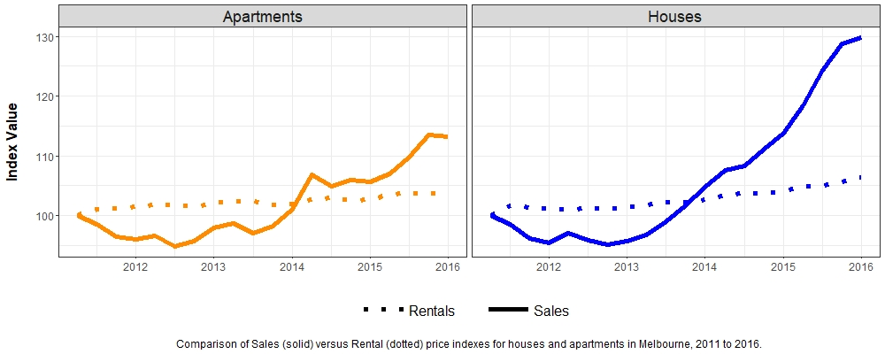
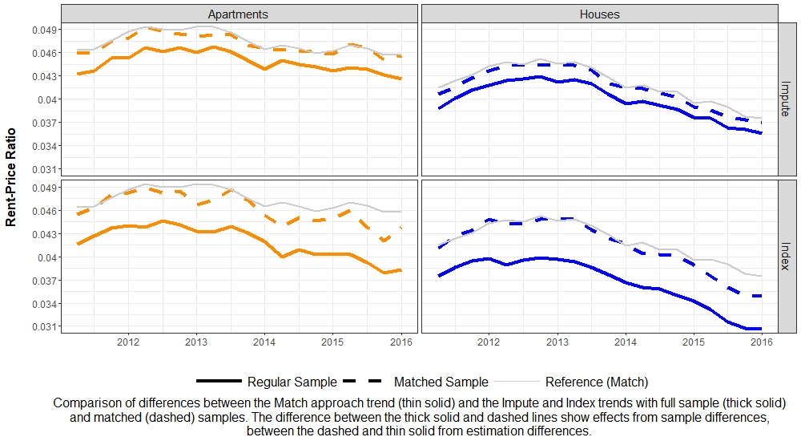
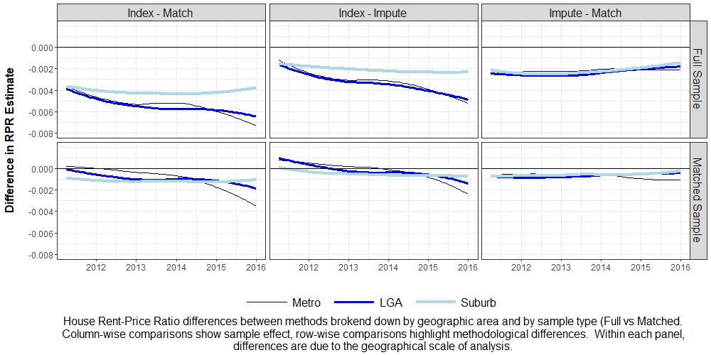

## Introduction

The relationship between home rents and sale prices is a fundamental metric in the analysis of housing markets [@shiller2007understanding; @bracke2015house]. This relationship, often referred to as a `rent-price ratio', is used as a key input variable or observed metric for a variety of research objectives. These include, but are not limited to, the identification of housing bubbles or market disequilibrium [@capozza1996expectations; @Himmelberg2005; @Hill2016], analysis of rent vs. buy decisions [@beracha2012lessons] and estimation of returns to housing [@gelain2014house; @engsted2015predicting].

The vast majority of the body of literature in this field estimates rent-price ratios (and related user cost calculations) by comparing sales price index values to rent index values. The potential for and likelihood of bias resulting from the index comparison method due to the fact that sold homes and rented homes often differ in structural and land characteristics and location is well noted [@Himmelberg2005; @glaeser2007arbitrage; @verbrugge2008puzzling; @garner2009reconciling]. 

Recently, more complex methods that utilize property-specific observations -- hedonic imputation and direct matching -- have been developed and tested [@smith2006bubble, @hattapoglu2014dependency, @bracke2015house, @Hill2016]. While these two methods are able to compare more equivalent samples of rented and sold homes, they do offer a higher cost in terms of data requirements and computation.

To date, there has been little comparative work examining if the different methods produce different rent-price ratios and, if so, what factors are creating the variation in estimates. As a result, there is little advice available for the applied researcher on the choice of method and the consequences of that choice. In this paper we set out first to test if different methods create different rent-price ratio estimates. Finding considerable deviations in the ratio estimates, we then seek to explain these differences by examining two factors: 1) between-tenure sample composition, and; 2) geographic aggregation. In reflecting on the the factors that create the differences in values we suggest that choosing an estimation should also consider the purpose of the analysis or the research question being asked as certain methods are more appropriate for certain types of analyses and/or questions.  

We conduct this analysis using a dataset of more than 710,000 sales and rental observations from the Melbourne (Australia) metropolitan region over the January 2011 to December 2015 time period.  Melbourne is a particularly interesting case to study as nearly all of the rental properties in the region are held by small-scale, private investors equating to a large number of properties, both houses and apartments, that have both sold and rented in our study period. 

## Existing Research

Depending on the discipline or use, the relationship between rents and prices may be referred to 'price-to-rent ratio' [@Himmelberg2005; @glaeser2007arbitrage; @goetzmann2012subprime], 'rent-price ratio' [@Campbell2009; @bracke2015house], 'P/R Ratio' [@pancak2017prr], 'rental yield' [@fu2001market] and 'dividend price ratio' [@hwang2006dividend]. Within this study we will use the term 'rent-price ratio.' Being expressed as such, the annual rental amount is the numerator and the sale price or home value is the denominator.

A diverse collection of housing research utilizes rent-price ratios (RPRs) as a key metric. One of the more common purposes is in the testing of market fundamentals and/or equilibrium [@capozza1996expectations; @ayuso2006house; @ambrose2013house; @sommer2013equilibrium; @Hill2016].  RPRs are also employed in the identification of periods of mispricing or bubbles [@Himmelberg2005; @smith2006bubble; @brunnermeier2008money; @pavlidis2013episodes]. Related, a number of studies make direct comparisons between rents (rental user costs) and the full user costs undergone by home owners in lieu of rent-price ratios [@Himmelberg2005; @verbrugge2008puzzling; @feng2015bubble]. Despite this slight departure in method, user costs are heavily dependent on the underlying rent and home price levels and, therefore, are as susceptible to deviations from estimation methods as the more traditional RPRs calculations.   

A second class of research that commonly uses RPRs examine how expectations of housing returns and/or future capital appreciation can impact market decisions [@hwang2006dividend; @gelain2014house; @hattapoglu2014dependency; @engsted2015predicting].  Finally, rent-price ratios are also occasionally used as independent or explanatory variables in peripherally-related studies explaining mortgage supply [@goetzmann2012subprime], house prices levels [@hwang2006economic] and spatial arbitrage opportunities [@glaeser2007arbitrage].  

In the majority of studies RPRs are calculated by comparing rent and sale price index values for a particular geographic area. The index comparison approach can, therefore, be considered an `aggregate' method of calculation. While this method is computationally cheap and the data is often readily available, it does suffer from a number of issues, most notably the fact that the composition (type, quality and location) of homes that sell are often vastly different from those that rent [@hattapoglu2014dependency; @bracke2015house]. 

Recently, there has been increased interest in both describing the trends that explain movements in the rent-price ratios [@Campbell2009] as well as improving the methods used to calculate the RPR estimates themselves [@hattapoglu2014dependency; @bracke2015house; @Hill2016].  To address issues pertaining to compositional differences, two additional methods have been used to create alternate estimates of rent-price ratios using property-level observations; 1) hedonic imputation; and 2) direct matching.

The hedonic imputation method utilizes hedonic price models of rents and sale prices to create an imputed sales price for rental observations and an imputed rental amount for sales observations [@hattapoglu2014dependency; @Hill2016]. Hattapoglu and Hoxha [-@hattapoglu2014dependency] create three sets of rent-price ratios, sold with imputed rent, rented with imputed price and imputed rent divided by imputed price.  Sensitivity tests on their aggregated (at neighborhood level) rent-price ratios shows only a small difference in the impact of the three sets of numerator and denominator combinations on their results.  Hill and Syed [-@Hill2016], on the other hand, only utilize the imputed rent divided by imputed price approach. Finally, Bracke [-@bracke2015house] estimates a rent and sales price for a set of properties and then regresses that ratio on a set of structural characteristics to determine each variables' impact on the rent-price ratio.

Direct matching involves matching rents and sale prices from the same or similar homes. Bracke's [-@bracke2015house] work in London uses direct matches of homes that have both sold and rented.  To avoid issues of changes in market prices over time, he limits the matches to those within six months of each other.  Leveraging the unique Chonsei system in Korea, Hwang et al. [-@hwang2006dividend] are able to directly observe rental and sales prices of apartments in Seoul to analyze `dividend-price ratios' (rent-price ratios).  Due to a limited number of perfectly matched pairs, Smith and Smith [-@smith2006bubble] opt for a proximity matching approach that derives a rent-price ratio from similar, but not identical, homes that have both sold and rented.

A review of literature shows that despite the the potential for deviations resulting from differences in the rent and sale samples, most academic research and industry application of rent-price ratios employ an index-based approach.  Recently, more complex methods such as the hedonic imputation and direct matching approaches have been presented and tested; however, no comparison to date shows the level of difference in estimates, if any, that exists between the choice of estimation method.

## Estimating Rent-Price Ratios

An accurate rent-price ratio provides the ratio of market values (rent value and sale value) for two different tenure types for the same property at the same time.  There are a number of phenomena related to housing units that make determining rent-price ratios difficult: 1) Heterogeneity in unit type, quality and location; 2) Individual units do not exist in both tenure types at the same time (usually); 3) Units do not sell or rent each period of analysis; and 4) Observed units differ in type, quality and location between tenure types (the samples are not identical). As a result, there is no baseline true value of a rent-price ratio in any given area at any given time.  Rather, analysts estimate this relationship using one of the methods described below.  

Within this paper, we look at the differences between the estimates from the various methods in a relative sense as we cannot compare these to a known truth or baseline value.  We refer to these relative differences as 'deviations' and not 'biases', as a bias suggests deviation from a known or correct value. This is not, however, to say that certain estimates are not 'better' than others. In choosing between the different methods the purpose of the analysis and/or the use to which the RPR is being put is important.  For instance, an analysis looking into the potential rent and price for all homes in the market, regardless of their propensity to rent or sell, is different from an analysis focused solely on those homes that actually have sold or rented.  Overall, there may not be a 'best' RPR metric or a true RPR value, but rather there are 'better' RPR metrics to answer specific research questions.  We more fully map this concept of 'purpose' to the methods in the recommendations section at the end of this paper. 

### Specific Methods

Table 1 highlights the differences between the three methods in terms of comparison type and data usage. The index comparison method first aggregates within each tenure type and then computes the ratio between rents and prices.  Conversely, the impute and match methods first compute a property-specific ratio and then aggregate up to a geographic level. The data used by each method varies as well.  The index method uses predefined price and rent indexes, the impute methods uses the full set of transactional data in the market, while the match method uses a limited sample of matched rentals to sold properties (usually the same property). As a result of these differences, variations in the estimates are likely in the event that the rental and sold markets have a different composition of homes. A complete explanation of each follows.

\begin{table}[ht]
 \centering
 \caption {Summary of Price-Rent Ratio Methods}
 \label{table:summeth}
 \begin{tabular}{lccc}
   \hline
   \hline
   \textbf{Method} & \textbf{Comparison Type} & \textbf{Data Requirements}\\
   \hline
   Index Comparison & Aggregate & Index Values\\
   Impute Regression & Property-Specific & Full Sample of Transactions\\
   Direct Match & Property-Specific & Matched Sample of Transactions\\
   \hline
   \hline
  \end{tabular}
\end{table}

\subsection*{Index Comparison}
  
The index comparison method involves comparing a rent index value to a price index value at the same time for the same area.  Presuming that a rent-price ratio (RPR) can be derived from nominal rent and price values at the base period of the indices, then the RPR can be calculated by multiplying the base period RPR by the ratio of the rent to price index values in all other (non-base) periods. The rent-price ratio at time \textit{t} in a particular geographic area \textit{j},  \textit{RPR$_{j, t}$}, is represented as: 
  
\begin{equation}
 RPR_{j,t} = \frac{NVR_{j,0}}{NVP_{j,0}} * \frac{IVR_{j, t}}{IVP_{j,t}}
\end{equation}
  
where \textit{NVR$_{j,0}$} is the nominal base (time $=$ 0) rental amount in area \textit{j}, \textit{NVP$_{j,0}$} is the nominal base (time $=$ 0) price, \textit{IVR$_{j,t}$} is the rental index value at time \textit{t}, and \textit{IVP$_{j,t}$} is the price index value at time \textit{t}.  If a series of nominal rental and home prices are available, then the RPR at time \textit{t} in area \textit{j} can be calculated by dividing the nominal rent series value by the nominal home price series value:

\begin{equation}
 RPR_{j,t} = \frac{NVR_{j, t}}{NVP_{j,t}}
\end{equation}

where \textit{NVR$_{j,t}$} and \textit{NVP$_{j,t}$} are the nominal rental value and nominal sales values in area \textit{j} at time \textit{t}, respectively.

\subsection*{Hedonic Imputation}
  
The hedonic imputation approach uses property-level transaction data to impute the likely rental amount for sales and likely sale price for rentals.  More specifically, a hedonic price model is built using all sales observations and then used to predict the likely sale price of all rental observations at the time of the rental contract.  Likewise, the same is done using all rental observations to predict the likely rental amount at the time of the sale for sold properties.  This process creates a sale price and rental amount for each observation in the dataset.  For sales, the sale price is observed and the rental amount is imputed; for rentals the rental amount is observed and the sale price is imputed.  The relationship between these two values represents the observation specific (as of the date of the observed transaction) rent-price ratio.  
  
For an observed sale, the rent-price ratio is expressed as: 
  
\begin{equation}
  RPR_{i,t} = \frac{\widehat{R_{i,t}}
    }{
    SP_{i,t}
    }
\end{equation}
  
where \textit{RPR$_{i,t}$} is the rent-price ratio for property \textit{i} at time \textit{t} (the time of the sale), \textit{SP$_{i,t}$} is the observed sale price at time \textit{t} and $\widehat{R_{i, t}}$ is the predicted or imputed rental value at time \textit{t} expressed by the following standard hedonic price or rent equation:
   
\begin{equation}
  {R_{i,t}} = \beta_{0} + \beta_{1} X_{i} + \epsilon _{i} 
\end{equation}  
  
where \textit{X$_{i}$} is the vector of independent variables for property \textit{i}, \textit{$\beta_{0}$} is a constant, \textit{$\beta_{1}$} is a vector of estimated coefficients and \textit{$\epsilon _{i}$} is an error term. 
  
Likewise, for an observed rental, the rent-price ratio is expressed as: 
 
\begin{equation}
 RPR_{i,t} = \frac{R_{i,t}
   }{
   \widehat{SP_{i,t}}
   }
\end{equation}

where \textit{RPR$_{i,t}$} is the rent-price ratio for property \textit{i} at time \textit{t} (the time of the rental), \textit{R$_{i,t}$} is the observed rental value at time \textit{t} and \textit{$\widehat{SP_{i, t}}$} is the predicted or imputed sale price at time \textit{t} expressed by the following standard hedonic price or rent equation:

\begin{equation}
{SP_{i,t}} = \beta_{0} + \beta_{1} X_{i} + \epsilon {_i}
\end{equation}

where \textit{X$_{i}$} is the vector of independent variables for property \textit{i}, \textit{$\beta_{0}$} is a constant, \textit{$\beta_{1}$} is a vector of estimated coefficients and \textit{$\epsilon_{i}$} is an error term. The property-specific rent-price ratios are then pooled at the geographic level of analysis, \textit{j}, and an overall rent-price ratio is estimated by taking a measure of central tendency at time \textit{t}.

 \subsection*{Direct Matching}
 
A third method used to calculate rent-price ratios is the direct matching approach.  In this approach only properties that have both sold and rented in a given time period are considered. If insufficient pairs of sale/rentals of the same property are found, similar but different properties can be matched [@smith2006bubble].  As sales and rentals are rarely, if ever, simultaneous, an adjustment must be made to account for the time between the two observations. An RPR value can be calculated at both the time of the sale and the time of the rental, so each matched pair creates two RPR estimates. In the case of a sale that then rented, first the rental amount is adjusted back in time via a rent index to the time of the sale to create the first estimate and then the sale price is adjusted forward in time to the date of rental using a sale price index to create the second estimate. 

The rent-price ratio for the rental observation in this example matched pair is represented by:

\begin{equation}
RPR_{i,t} = \frac{R_{i,t}
  }{
  SPadj_{i,t}
  }
\end{equation}

where \textit{RPR$_{i,t}$} is the estimated rent-price ratio for property \textit{i} at time \textit{t} (when it was rented), \textit{R$_{i,t}$} is the value that it was rented at and \textit{SPadj$_{i,t}$} is the sale price adjusted by a market index to time \textit{t}. 

Similarly, the rent-price ratio for the sale observation in a matched pair is represented by:

\begin{equation}
RPR_{i,t} = \frac{Radj_{i,t}
  }{
  SP_{i,t}
  }
\end{equation}

where \textit{RPR$_{i,t}$} is the estimated rent-price ratio for property \textit{i} at time \textit{t} (when it was sold), \textit{Radj$_{i,t}$} is the rental value adjusted by a market index to the time at which the property sold, \textit{t}, and \textit{SP$_{i,t}$} is the sale price at time \textit{t}. Like the imputation method, the property-specific rent-price ratios are then pooled at the geographic level of analysis, \textit{j}, and an overall rent-price ratio is estimated by taking a measure of central tendency at time \textit{t}. 

## Data
  
To examine rent-price ratios estimates from the three methods discussed above we utilize property-level observations of home sale prices and rental lease amounts obtained from Australian Property Monitors (APM).^[http://www.apm.com.au, a member of the Domain Group]  These data include all transactions of single family homes and apartments^[Within the local Australian property industry and in our datasets, apartments and condominiums are labeled as 'units'. However, we will employ the more commonly used term 'apartment' so as to apply to the largest possible audience. Note that there is essentially no institutional rental market in Australia and thus when we use 'apartment' we mean a attached dwelling in a multi-family structure that is owned under a condominium-type regime. Or, in North American terms, a `condominium'.] in the Melbourne metropolitan region over the January 2011 to December 2015 time period.  After removing incomplete and outlying^[Homes with more than eight bedrooms or bathrooms, lots of more than 40,000 square meters and homes sold for less than \$150,000 or more than \$4,000,000 or rented for less than \$125 or more than \$2,500 per week (rentals are quoted per week in Melbourne).] observations, more than 710,000 individual transactions remained -- greater than 235,000 sales and 475,000 rentals. In addition to the transaction date and price, the data include more than 10 individual physical attributes^[Property Structural Type, Lat/Long, Lot Size, Number of Bedrooms, Bathrooms and Parking Spaces and Presence of a Pool, Garage, Fireplace, Den and Air Conditioning.] of the property along with the property address, latitude and longitude. Unfortunately, information on home age and living area is not commonly found in transactional datasets within Australia and is unavailable for the purposes of this analysis. 

In the direct matching method we identify properties that have both sold and rented during our study period. Due to these constraints, the direct match method uses a more limited set of data (120,000 vs. 710,000) than the index and hedonic imputation methods (see Table 2).  This relatively large number of matched properties is due to the fact that in the Australian residential markets there are very few institutionally-owned apartment buildings (as in North America and Europe) and, instead, most apartment (and condominium) properties are privately owned and, if not owner-occupied, rented out on the market.

\begin{table}[ht]
\centering
\caption {Data Overview}
\footnotesize
\label{table:data}
\begin{tabular}{lrrr}
  \hline
  \hline
  \textbf{Data Type} & \textbf{Houses} & \textbf{Apartments} & \textbf{Total} \\
   \hline
   & & & \\
   \textbf{\textit{Transaction Data}} & & & \\
   \hline
  Sales & 191,908 & 44,806 & 236,714\\
  \hline
  Rentals & 253,447 & 222,958 & 476,405\\
  \hline
  All & 445,355 & 267,764 & 713,119 \\
  \hline
  \hline
  & & & \\
  \textbf{\textit{Matched Observations}}  & & & \\
  \hline
  All & 81,804 & 38,597 & 120,401 \\
  \hline
  \hline
  \end{tabular}
 \end{table}

For apartments, there are more than five times as many rental observations as sales, whereas within the house market the count of sales and rentals are relatively equal.  This elevated ratio of rental to sales within the apartment market speaks to the much shorter tenure period that is common within apartment rentals compared to house rentals.  The difference in the total number of sales between houses and apartments is due to the general urban development patterns across Melbourne.  Like most Australian, US and Canadian cities, Melbourne has seen considerable growth in the post-WWII period, much of which has been in the form of low-density, peripheral development. As a result, single-family houses remain the dominant residential dwelling option through most of the region.  Only much more recently has the CBD and adjacent areas experienced a rapid increase of high density apartments.

Figure 1 shows the location of the observations, split by property and tenure type.  Darker areas show higher concentrations of observations.  Apartments are highly clustered in the inner areas of the metropolitan region. Additionally, rental apartments are more concentrated in the CBD and immediate surrounds than sold apartments.  For houses, there are small areas immediately east and south of the CBD that show a higher concentration of rental homes versus sold homes, otherwise there is a fairly even distribution of rental and sold home throughout the remainder (non-CBD areas) of the region.  

\section*{Comparison of Rent-Price Ratios}

In this section we compare estimates of rent-price ratios derived with the three methods discussed above. Ratios are estimated quarterly using the model specifications described below.  Initial exploratory analysis showed considerable differences between the apartment and house markets\footnote{Properties labeled as townhomes, villas, or terraces are treated as houses, while studios are treated as units.  These use types represent approximately 8.5\% of the cleaned observations} in Melbourne and, as a results, all of the analyses that follow treat these two sub-markets separately. 

\subsection*{Model Specifications}

Our index comparison method creates price and rent indexes using a weighted repeat sales (rental) method following the commonly used three-stage procedure described in Case and Shiller [-@Case1987] where the first step is:

\begin{equation}
  y_{it} - y_{is} = \beta_t D_{it} -\beta_s D_{is} + (\mu_{it} - \mu_{is})
\end{equation}

where $y_{is}$ is log of the initial transaction (sale or rental) price, $y_{it}$ is the log of the repeat transaction price, $D_{is}$ is the time of the initial transaction, $D_{it}$ is the time of the repeat transaction and $\mu_{is}$ and $\mu_{it}$ are observation specific errors. This simplies to:

\begin{equation}
  y_{its} = \beta_1 D_{its} + \mu_{its}
\end{equation}

where $y_{its}$ is the difference of logged transaction prices, $D_{its}$ is a set of dummy variable for all time periods in the data indicating the time of first transaction (-1), subsequent transaction (1) with all other period a 0 and $\mu_{its}$ is an error term. As contant quality violations may be related to the length of time between observations, the second stage models the residuals of the first as function of the time between observations:

\begin{equation}
  \mu_{its}^2 = \alpha + \phi_1 (D_{it} - D_{is}) + \epsilon_i
\end{equation}

where $\mu_{its}^2$ is the squared residual from the first stage, $(D_{it} - D_{is})$ is the time between the two transactions and $\epsilon_1$ is an error term. In the third stage the fitted values of the second stage are then used as weights when re-estimating the regression model specified in equation 10. The coefficients from the temporal dummy variables in equation 10 are used to create rent and price indexes via a Laspreyes method.

For the hedonic imputation method, we specify the following models:

 \begin{equation}
  log(P_i or R_i) = \alpha + \beta_1 STRUC_i + \gamma_1 TIME_i + \rho_1 LOCATION_i + \epsilon_i
 \end{equation}

where the dependent variable is either the natural log of the price (\textit{$P_i$}) or the natural log of the rental value (\textit{$R_i$}), \textit{$STRUC_i$} is a set of stuctural characteristics about the home, \textit{$TIME_i$} are quarterly time dummies and \textit{$LOCATION_i$} are location fixed effects.  For houses the list of structural characteristics include the size of the lot, number of bedrooms, number of bathrooms, presence of a garage and the presence of a pool.  Units include the same structural variables, minus the size of the lot.  Unfortunately in this dataset (and throughout most datasets in Australia) home size in square meters and the age, quality and condition of the home are not available. Finally, we use suburb location as the spatial fixed effects, \textit{LOCATION}.  Suburbs in Australia are generally much smaller than their North American counterparts.  For instance, there are nearly 350 suburbs in the study area. 

In the direct matching method we identify homes that have both rented and sold.  For each pair of sale/rental we calculate two estimates of rent-price ratio, one at the time of sale and one at the time of rental.  In the case of the sale (rental), we adjust the rental (sale) value to the sale (rental) date based on the rental (sale) index developed in the index comparison method and then divide the adjusted rental value by the (adjusted) sale price. This process creates two estimates of rent-price ratio for each sale-rental pair, one at the time of each transaction.  In the case of a home that has sold once and rented multiple times (or vice versa), we form a set of rent-price ratios for each paired set of sale-rent observations. 

For both the hedonic imputation and the direct matching methods the indexes are created by calculating the median rent-price ratio within each set of observations at each time period and then converting to an index value with a standard Laspreyes approach.  This is different from the index comparison method in that the median values are derived from individual properties which have observed (or imputed) both rent and sale prices.    

\subsection*{Initial Results}

To provide context for the results to follow, we begin by looking at the overall movements in the sale prices and rents. As shown in Figure 2, sale prices have increased much more dramatically than rents over the five-year study period, especially for houses. All of that growth in prices has occurred from the beginning of 2013 to end of 2015 period.  Over this three-year time frame apartment prices have risen about 15\% and house prices around 35\%.  For both structure types, rent increases over the entire five-year span remained a very consistent 1\% per annum.

Next, we calculate and compare the rent-price ratio for houses and apartments over the entire Melbourne metropolitan region using the three methods described above. As Figure 3 shows, rent-price estimates are generally higher in the apartment market than in the detached housing market. Overall, rates range from a low of 0.033 to a high of 0.049, suggesting that gross annual rents are equivalent to anywhere from 3.3\% to 4.9\% of the sales price depending on the structure type, time and method of estimation.  Controlling for method, this premium in the apartment market is around 0.4\% to 0.6\% of the sale price. 

The index comparison method estimates for both apartments (left panel) and houses (right panel) are considerably lower than the those for hedonic imputation which are in turn lower than the direct matching approach. Overall, within each structure type the three methods follow a generally similar pattern over time, that of rising rent-price ratios from 2011 to 2013 and then steeply declining from that point forward. The differences between the match and impute methods remain relatively constant over time, while in both markets the index method estimates decline more quickly than the others in 2014 and 2015. 

The differences in the estimates provided by the three methods are substantial with a nearly 20\% gap between the index and match estimates at the end of 2015. It is clear from this analysis that the differences between the methods highlighed in Table 1 are leading to deviations rent-price ratio estimates and trends. Below, we examine two factors that may be leading to these variations: 1) between-tenure sample composition; and 2) geographic aggregation. 

Note that we focus on 'between-tenure' issues; those that are likely to arise due to comparing sales and rentals. We purposefully ignore 'within-tenure' issues for two reasons.  First, these issues such as sample selection bias in index creation [@case1991choosing, @haurin1991house, @wallace1997construction, @nagaraja2014repeat] and hedonic model misspecification [@Meese1991, @McMillen2003, @Mcmillen2006] are covered in length by other authors. 'Between-tenure' issues on the other hand are rarely addressed. And second, and most importantly, we use identically specified models and sample selection methods for sales and rentals within each of the three methods and, therefore, any impact of `within-tenure' issues are likely to impact both the individual sale and rent indexes and values somewhat equally and will cancel out in the division that creates the rent-price ratio.

### Tenure Composition

The matching method utilizes a materially different and more restrictive sample than the index or imputation approach.  This restricted sample includes only those homes that have both sold and rented. As a result, there is the possibility that the deviation (or some part thereof) between the three RPR trends are a result of the differences in the samples and not the methods themselves. We examine this possibility by comparing the original index, imputation and matching estimates with estimates generated by the index and imputation method that rely only on the restricted sample used by the matching method.

From this analysis (Figure 4) we find that for both apartments and houses the imputed rent-price ratios (top panels) created with the restricted matched sample (dashed line) are markedly higher than those from the full sample (thick solid line).  The restricted sample imputation estimates are also very similar to the ratios from the matched approach (thin line). Correcting for differences between the two samples creates essentially identical rent-price ratios trends between the impute and match method.  This finding suggests two things.  First, that the assumption by previous authors [@Himmelberg2005, @glaeser2007arbitrage, @verbrugge2008puzzling, @garner2009reconciling] that the sold and rented markets have measurably different samples proves true and that the sold market contains more expensive dwellings than the rental market.  Second, this also adds validation to the models used in the imputation and the match adjustment processes.

The matched sample (dashed line) index estimates (bottom panels) both increase to a greater degree than the restricted imputation sample (top panels).  From 2011 to the beginning of 2014, the matched sample index estimates nearly mirror those of the matched and imputation methods.  However, from 2014 onward a divergence occurs across both the apartment and house market.

### Geographic Disaggregation

After correcting for differences in tenure sample composition there remains some deviation betwen the index method and the impute and match approach.  This deviation largely exists during 2014 and 2015, a period of very strong house price appreciation but slow and steady rental growth (Figure 3). As discussed above, the index method uses an aggregate approach whereas the impute and match method make property-specific comparisons. By aggregating and then calculating, it is possible that if the composition of rental and sold homes changes over time, even when controlled by the restricted sample, then the index method may be biased.  As an example, if within the restricted sample the larger homes rented at a higher relative frequency during one period and sold at a higher relative frequency in another, the index method would be biased in both periods.  In other words, the index approach does not control for the temporal variation of within-tenure composition changes, whereas the impute and match methods do.

While a significant change in the tenure mix of larger versus smaller homes over time may be unlikely, significant changes to the location of the tenure mix is much more plausible.  As urban areas initially develop, re-develop or gentrify the tenure mix in these areas can change very quickly.  Such movements in local property sub-markets are also more likely during periods of strong market growth, similar to that experienced in Melbourne over 2014 and 2015.

We can test for the potential of changing locational demand between tenure types by performing our comparative analyses at smaller levels of geographic disaggregation.  This allows us to examine if the differences between methods vary based on the geographic level of analysis.  To test this proposition we recalculate rent-price ratio methods for both the full and the matched-only samples at the Local Government Area (LGA) and the Suburb level.  Comparisons between the three methods, at all three geographic levels (Metro, LGA and Suburb) and across the full and the matched-only samples are showing in Figures 5 and 6, for houses and apartments, respectively. The trend lines for LGA and Suburb are calculated by first comparing the differences between methods in each individual geographic area (LGA or Suburb) and then taking a measure of central tendency of the area-specific values at each time period of analysis.\footnote{Time trends are smoothed with a LOESS.}

Figure 5 shows that moving to an LGA- or Suburb-level analysis has little impact on comparisons in the matched sample (bottom panels) but does decreases the differences between the index-impute (left panel) and the index-match (middle panel) comparisons in the full sample (top panels). This change is most evident in 2014 and 2015 period suggesting that controlling for changes to the geographic tenure mix has corrected for the large change in deviation between the index and the other methods during the period of strong market activity. No measurable change is seen when making the impute-match comparison (right panel) across the three geo-levels. 

Examining the house market (Figure 6) tells a similar, but more convincing story regarding the usefulness of geographic disaggregation.  Again, the temporal variation in the differences between the index-impute (left panel) and the index-match (middle panel) comparisons are mostly alleviated by switching to a smaller geographic disaggregation,  Here, however, it is only the smallest disaggregations, the suburbs, that provide the proper correction. This suggests that there has been an observable change in the locational rent/sale mix in the house market during the strong market conditions of late 2014 to 2015. Comparisons between the impute and match methods show little relationship to the level of geographic disaggregation due to the fact that the comparisons are already being made at the property level\footnote{Additionally, the impute models control for location with spatial fixed effects at the suburb level.}.

Overall, both Figures 5 and 6 also re-iterate the gains in similarity between the trends made by switching from the full to the matched sample. These gains are realized across all three geographic disaggregations, suggesting that simply analyzing samples at finer geographic aggregations is not a substitute for using a matched sample, if the goal is reconciling estimates. 

\section*{Discussion}

Recent research on rent-price ratios has developed alternatives -- hedonic imputation and direct matching -- to the oft-used index comparison approach.  This work compares the estimates of these three methods across the Melbourne metropolitan area over the 2011 to 2015 time period.  Results are bifurcated between the house and apartment markets. 

We find considerable deviations in the resulting rent-price ratio estimates across the three methods, with the match estimates consistently higher than the impute estimates which are consistently higher than the index estimates. Additionally, we find that rent-price ratio estimates are considerably higher for apartments than for houses. Finally, the deviations between the impute and match methods remain stable over time, but the index method diverges from the other two during the period of high home price appreciation experienced in 2014 and 2015. 

We then set out to the explain the deviations between the estimation methods.  First, we restrict the sample to homes that have both rented and sold (the data used by the match method) and re-estimate the index and impute methods.  By limiting the sample, we explain nearly all of the deviations between the impute and match methods for both houses and apartments. Much of the deviations between the index method and the other two are explained by limiting the sample as well, with the exception of estimates from the 2014 to 2015 time period.  As the rent-price ratios from the index and impute methods increase substantially when using the matched-only sample, this suggests that the market composition of rent and sold homes are different and that sold homes are generally more expensive, as suggested, but not tested, by previous work  [@Himmelberg2005, @glaeser2007arbitrage, @verbrugge2008puzzling, @garner2009reconciling].

Spatially disaggregating the matched sample analysis helps to explain more than half of the remaining variation between the index method and the two others. This is most evident when analyzing estimates at the suburb level in the house market. This finding suggests that during the strong price appreciation in 2014 and 2015 there was a measurable change in the location dynamics of the tenure mix within the housing market. 

Our two attempts at accounting for the variation between the methods has left a small measure of deviation unexplained (less than 0.001). These unexplained differences are most evident when comparing the index method to the impute and match methods. We propose that within-tenure modeling issues such as model misspecification may play a role is the differences in estimates during this time period, but leave verification of this for future resarch. 

\subsection*{Recommendations}

It bears repeating that we do not consider any of the methods used to be the `correct' method. From the results above, we see that the hedonic imputation and the direct matching approach offer more stable estimates both over time and level of geographic disaggregation. This stability is aided by the fact that these two methods are property specific and are able to better control for changes in the locational dynamics of the rent/sale mix over time. 

As noted earlier, when choosing between the impute and match method the purpose of the analysis and the intended meaning of the rent-price ratio should be carefully considered.  The imputation method, by virtue of creating a rental and sales value for each rented and sold property in the market, is best at addressing research questions looking to analyze the potential rent-price ratio for all homes in the market, regardless of whether or not they are actually renting or selling.  This type of analysis can be very useful in user-cost calculations or exercises that are looking to quantify imputed rents for owner occcupied homes. Or, in other words, the imputation method is most useful for investigations into hypothetical market dynamics.  

The match method, on the other hand, only measures the rent-price ratio for homes that are, or have recently been, actively rented or sold.  As we see in Figure 4, this restricted sample of homes is materially different than the full sample of homes on the market, namely of a lower sale price.  In other words, high end homes are not as equally represented in the rental market as they are in the for sale market. In contrast to the imputation method, the matched method is preferable when analysing the actual, on-going dynamics of homes that are being rented and sold.

The added stability and specificity of the impute and matched approaches come with a cost; data availability.  While access to property-specific sales and rental data is increasing, it may still be unavailable or unaffordable for researchers in certain areas.  In these cases, the index method is the only available option.  In such cases, our results show that the smaller the geographic aggregation of the index, the more stable and better able the index method is to correlate with the impute and match estimates.  As we also found that high end sold homes may exert a downward influence on rent-price ratios derived from an index method, and, as a result, the use of a price stratified index or some other specification that limits the influence of the tendency for sold homes to be of a higher quality and price than rentals may be helpful. 

We also find that there are consistent and measurable differences between the rent-price ratios for apartments and homes and that analyses of RPR trends should take structure type into account if possible.  When analyzing apartments, which are more centrally located and geographically clustered, we do find that benefits of geographic disaggregation, especially after controlling for tenure sample composition are more limited than when analyzing the house market. 

Finally, our observations suggest that RPRs created by index comparison tend to diverge from those created by the other two methods to a greater extent during strong market (home price appreciation) periods.  This metric -- the deviation between index-based RPRs and impute or matched ones) may offer another metric to measure market disequilibrium and adherence to fundamentals.  With careful disaggregation spatially, it can also signal regions that are changing dominant tenure type, whether it be a transition from ownership to renting or vice versa as is often seen in a gentrifying neighborhood. 

In sum, researchers should recognize that the choice of method for estimating the relationship between housing rents and prices will influence the estimate values.  The purpose of the analysis and the available data sources are the key considerations that should be given when determining which method to use. Future work should seek to validate these results across other cities, ideally in different countries to determine if these results are unique to the Australian market.  More work could also be applied to examine the accuracy of statistical models underlying the estimation methods during times of volatile market activity. 

As a matter of reproducibility and transparency, all code used to complete this analysis is available https://github.com/anonymousreAuthor/rprComparisonPaper. \footnote{This link will be moved to the Author's Github page after anonymous review.} Unfortunately the raw data is proprietary but the authors are happy to share intermediate results.   

\subsubsection*{Acknowledgements}

The authors would like to thank Australian Property Monitors (APM) and the Domain Group for the use of their transactional data and the Australian Urban Research Infrastructure Network (AURIN) for the geographic data.

# References
